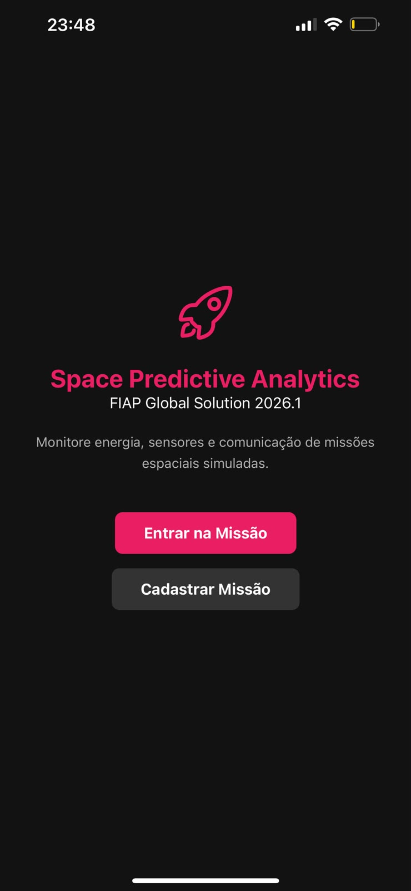
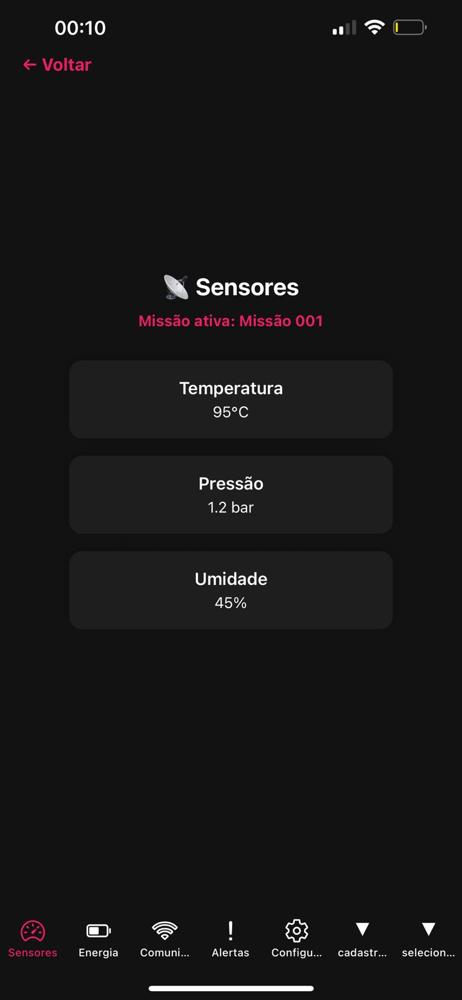
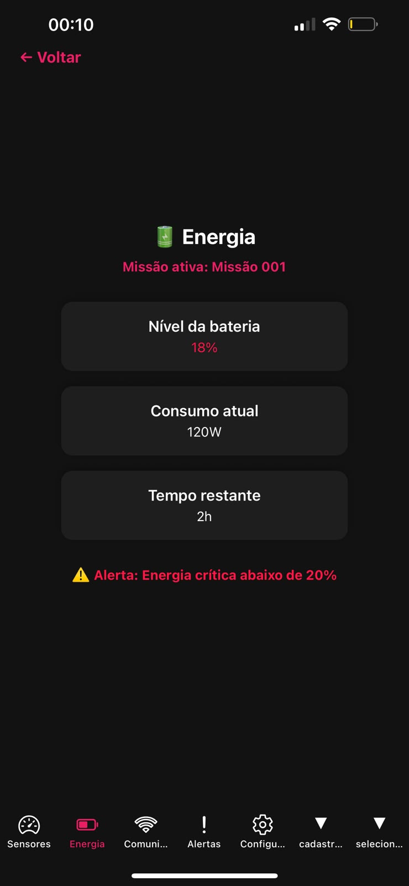
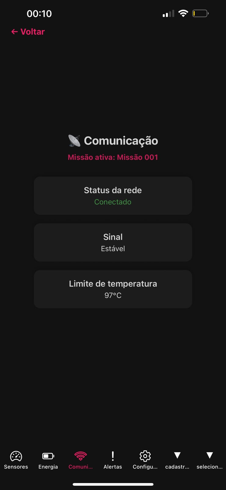
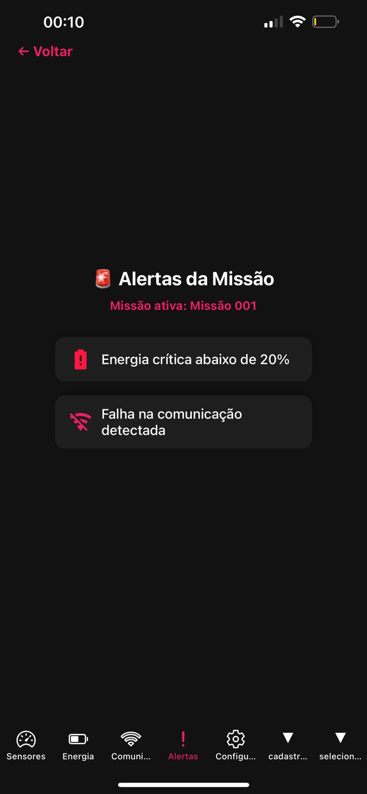
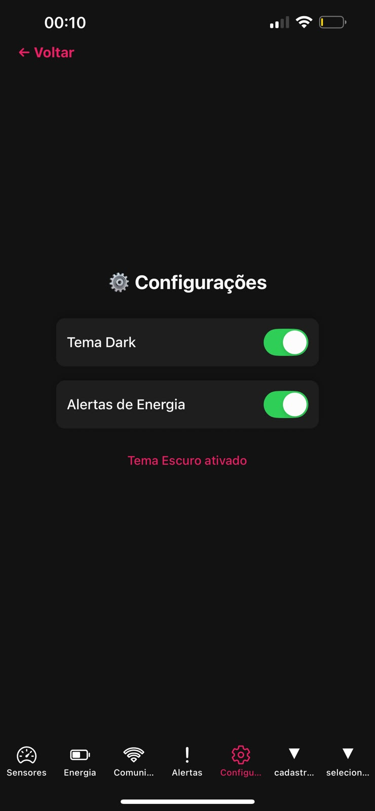

# Sistema de Monitoramento de Missões
### Global Solution 2026.1 — Cross-Platform Application Development | FIAP

---

## 👥 Equipe
| Nome Completo | RM |
|---------------|----|
| Rafael Silva Oliveira Nascimento | 565415 |
| Pedro Noronha dos Santos | 564572 |
| Lucas Franco de Godoy Fortes | 561723 |

---

## 📌 Descrição
Aplicativo desenvolvido em **React Native + Expo** para monitoramento de missões espaciais.  
Permite cadastrar missões, selecionar a ativa e acompanhar dashboards de **Sensores**, **Energia**, **Comunicação** e **Alertas**.  
A solução simula dados críticos e gera alertas automáticos, dentro do contexto de *Space Predictive Analytics*.

---

## 📲 Telas do Aplicativo

### Home — Seleção de Missão


### Dashboard de Sensores


### Dashboard de Energia


### Dashboard de Comunicação


### Alertas


### Configurações / Cadastro


---

## ✅ Funcionalidades
- [x] Navegação com **Expo Router** (Tabs + Stack)
- [x] Mínimo de 3 dashboards distintos (Sensores, Energia, Comunicação)
- [x] Estado global com **Context API** (dark mode e tema)
- [x] Persistência com **AsyncStorage** (missões e limites de alerta)
- [x] Formulário funcional com validação (Cadastro de Missão)
- [x] Sistema de alertas automáticos (energia crítica, temperatura, comunicação)
- [x] Interface temática espacial com ícones e cores
- [x] Responsividade testada em diferentes telas
- [ ] Integração com API externa (bônus)
- [ ] Tipagem completa com TypeScript (bônus)

---

## 🛠️ Tecnologias
- React Native + Expo
- Expo Router
- AsyncStorage
- Context API
- Animated API
- TypeScript (parcial)

---

## 🚀 Como Executar

### Pré-requisitos
- Node.js instalado
- Expo CLI: `npm install -g expo-cli`
- Expo Go instalado no celular (iOS ou Android)

### Instalação
```bash
git clone https://github.com/seu-usuario/monitoramento-missoes.git
cd monitoramento-missoes
npm install
npx expo start
